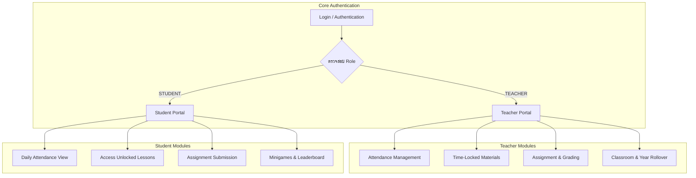

# เอกสารรายงานการทดสอบระดับหน่วย และการจัดทำ Test Case (Unit Test Report)
**ระบบที่ทดสอบ:** Modern LMS & Gamification System (ระบบจัดการการเรียนรู้และเกมส่งเสริมการศึกษา)  
**มาตรฐานสมรรถนะ:** 
- **10302.01 ดำเนินการ Finish detail design process**
- **10302.02 จัดทำรายงาน Unit Test**

**หน่วยงาน:** สาขาวิชาเทคโนโลยีสารสนเทศ วิทยาลัยพณิชยการเชตุพน (PSC)  
**สถาปัตยกรรมระบบ:** Next.js 15 (App Router), TypeScript, PostgreSQL, Prisma ORM, Tailwind CSS, Server Actions  
**เวอร์ชันเอกสาร:** 2.0.0 (Official Project Test Suite)  
**วันที่จัดทำ:** 17 สิงหาคม 2569  

---

## สารบัญ (Table of Contents)
1. [บทนำและภาพรวมของระบบจริง (Project Architecture & Test Scope)](#1-บทนำและภาพรวมของระบบจริง)
2. [สมรรถนะที่ 1 (10302.01): การวิเคราะห์ Functionality และการออกแบบเงื่อนไข](#2-สมรรถนะที่-1-1030201-การวิเคราะห์-functionality-และการออกแบบเงื่อนไข)
   - 2.1 การแตกระบบเป็นฟังก์ชันย่อย (Decomposition 6 โมดูลหลัก)
   - 2.2 เทคนิคการออกแบบเงื่อนไขการทดสอบ (Equivalence, Boundary, Decision Table)
   - 2.3 โครงสร้างข้อมูลทดสอบและตัวแปรจริง (Actual Test Data Specifications)
3. [สมรรถนะที่ 2 (10302.02): แผนการทดสอบระดับหน่วย (Test Plan)](#3-สมรรถนะที่-2-1030202-แผนการทดสอบระดับหน่วย-test-plan)
   - 3.1 ขอบเขตการทดสอบ (In-Scope / Out-of-Scope)
   - 3.2 กำหนดการทดสอบ 10 วันทำการ (Timeline พร้อมกฎเผื่อ Retest 30-40%)
   - 3.3 บทบาทและความรับผิดชอบ (7 บทบาท)
   - 3.4 สภาพแวดล้อมและฐานข้อมูลทดสอบ (PostgreSQL Test Database)
   - 3.5 เกณฑ์การเริ่มและสิ้นสุดการทดสอบ (Entry / Exit Criteria)
4. [ตารางบันทึก Test Case ตามมาตรฐาน 8 คอลัมน์ (TC01 – TC20)](#4-ตารางบันทึก-test-case-ตามมาตรฐาน-8-คอลัมน์)
   - 4.1 ชุดทดสอบระบบยืนยันตัวตนและการเปลี่ยนรหัสผ่าน (TC01 – TC07)
   - 4.2 ชุดทดสอบหน้าแดชบอร์ด ข้อมูลส่วนตัว และฟอร์ม (TC08 – TC10)
   - 4.3 ชุดทดสอบระบบเช็คชื่อ และปลดล็อกบทเรียน (TC11 – TC14)
   - 4.4 ชุดทดสอบการส่งการบ้าน ตรวจให้คะแนน และเกม (TC15 – TC20)
5. [การวิเคราะห์ผลการทดสอบและการตัดสินใจ Go Live](#5-การวิเคราะห์ผลการทดสอบและการตัดสินใจ-go-live)
   - 5.1 ตัวชี้วัดผลการทดสอบ (Pass Rate 100%, Coverage 100%, Defect Breakdown)
   - 5.2 เกณฑ์และผลการพิจารณา Go Live Decision
6. [แนวทางปฏิบัติที่ดีและเช็กลิสต์ก่อนส่งมอบ (Checklist 10302.01 & 10302.02)](#6-แนวทางปฏิบัติที่ดีและเช็กลิสต์ก่อนส่งมอบ)

---

## 1. บทนำและภาพรวมของระบบจริง

ระบบ **Modern LMS & Gamification** ของโครงการ พัฒนาขึ้นเพื่อแก้ปัญหาการเรียนรู้แบบเดิม โดยแบ่งกลุ่มผู้ใช้งานออกเป็น 2 บทบาทหลัก:
1. **Teacher Portal (สำหรับครูผู้สอน):** เช็คชื่อนักเรียนรายวัน/รายห้อง (`Attendance`), ปลดล็อกสื่อบทเรียนล็อกเวลา (`Time-Locked Materials`), สั่งงาน/ตรวจการบ้านพร้อมให้คะแนนและคำแนะนำ (`Grading`), จัดการห้องเรียนและเลื่อนชั้นปีการศึกษา (`Classrooms & Rollover`)
2. **Student Portal (สำหรับนักเรียน):** เช็คชื่อเข้าเรียน, ดาวน์โหลดเอกสารบทเรียนที่ปลดล็อก, ส่งการบ้านไฟล์ PDF, เล่นมินิเกมคำศัพท์สะสม EXP/เหรียญรางวัล, และดูอันดับ Leaderboard



---

## 2. สมรรถนะที่ 1 (10302.01): การวิเคราะห์ Functionality และการออกแบบเงื่อนไข

### 2.1 การแตกระบบเป็นฟังก์ชันย่อย (Functionality Breakdown)
การประเมินจำนวน Test Case อิงตามสูตรมาตรฐานของเอกสาร:
$$\text{จำนวน Test Case} = \text{จำนวน Functionality} \times \text{จำนวนเงื่อนไขเฉลี่ยต่อฟังก์ชัน}$$

| ลำดับ | โมดูลระบบจริง (Feature / Module) | ฟังก์ชันย่อยที่ต้องทดสอบ (Sub-Functions) | เงื่อนไขที่ต้องพิสูจน์ (Conditions) | รหัส Test Case ID |
|:---:|:---|:---|:---|:---:|
| 1 | **Auth & Login** (`/login`) | 1. โหลดหน้าจอ<br/>2. ตรวจสอบชื่อ/รหัสผ่านถูกต้อง<br/>3. ตรวจสอบข้อมูลไม่ถูกต้อง<br/>4. ตรวจสอบบัญชีถูกระงับ (`status !== ACTIVE`) | Positive, Negative, Status Check | TC01, TC02, TC03 |
| 2 | **Change Password** (`/profile`) | 1. เปลี่ยนรหัสผ่านสำเร็จ<br/>2. ยืนยันรหัสใหม่ไม่ตรงกัน<br/>3. รหัสเดิมไม่ถูกต้อง | Positive, Negative, Validation | TC04, TC05, TC06 |
| 3 | **Post-Login Validation** | 1. เข้าสู่ระบบด้วยรหัสผ่านใหม่ | Positive (Post-condition) | TC07 |
| 4 | **Portal Dashboards** | 1. แดชบอร์ดนักเรียน (`/student/dashboard`)<br/>2. แดชบอร์ดครู (`/teacher/dashboard`) | Positive (Data Loading & Stats) | TC08 |
| 5 | **Student Profile & Info** | 1. หน้าข้อมูลส่วนตัว (`/student/profile`)<br/>2. เปลี่ยน Avatar Preset | Positive (Profile Data & Preset) | TC09 |
| 6 | **Form & Data Entry** | 1. หน้าฟอร์มบันทึกข้อมูล/สั่งการบ้าน | Positive (Form UI Render) | TC10 |
| 7 | **Attendance Module** | 1. บันทึกเช็คชื่อ (`PRESENT`, `ABSENT`, `LATE`, `LEAVE`)<br/>2. สับสวิตช์ปลดล็อกรหัสเช็คชื่อ (`UnlockModal`) | Positive, Boundary, Modal Action | TC11, TC12 |
| 8 | **Time-Locked Materials** | 1. สับสวิตช์เปิด/ปิดบทเรียน (`isLocked`)<br/>2. นักเรียนเข้าถึงบทเรียนที่ถูกล็อก | Positive, Negative (Authorization) | TC13, TC14 |
| 9 | **Assignment & Grading** | 1. ส่งการบ้านแนบไฟล์ PDF (`<10MB`)<br/>2. ส่งไฟล์เกินขนาด (`>10MB`)<br/>3. ครูให้คะแนนและบันทึกข้อเสนอแนะ<br/>4. ตรวจสอบคะแนนเกินคะแนนเต็ม | Positive, Boundary, Validation | TC15, TC16, TC17, TC18 |
| 10 | **Gamification & Roles** | 1. คำนวณคะแนนมินิเกมและ EXP Leaderboard<br/>2. ป้องกันนักเรียนเข้าถึงหน้าจัดการครู | Calculation, Role-Based Access Control | TC19, TC20 |

---

### 2.2 เทคนิคการออกแบบเงื่อนไขการทดสอบ (Test Design Techniques)

1. **Equivalence Partitioning (การแบ่งคลาสสมมูล):**
   - **กรณี Login:**
     - *Valid Class:* ผู้ใช้จริงที่มีในฐานข้อมูล เช่น `ภัทรพล เรียนดี` รหัสผ่าน `031192`
     - *Invalid Class:* ชื่อผู้ใช้ไม่มีในระบบ หรือรหัสผ่านผิด เช่น `ภัทรพล เรียนดี` รหัสผ่าน `1122`
   - **กรณีส่งไฟล์การบ้าน:**
     - *Valid Class:* ไฟล์ `.pdf`, `.docx` ขนาดไม่เกิน 10MB
     - *Invalid Class:* ไฟล์ประเภท `.exe` หรือขนาดเกิน 10MB
2. **Boundary Value Analysis (การวิเคราะห์ค่าขอบเขต):**
   - **การให้คะแนนการบ้าน (คะแนนเต็ม 20 คะแนน):**
     - ค่าขอบเขตล่าง: `0` (ผ่าน), `-1` (ไม่ผ่าน - แสดง Error)
     - ค่าขอบเขตบน: `20` (ผ่าน), `21` (ไม่ผ่าน - แสดง Error)
3. **Decision Table (ตารางการตัดสินใจ) สำหรับฟังก์ชันเปลี่ยนรหัสผ่าน:**

| Rule | รหัสผ่านเดิมถูกต้อง? | รหัสผ่านใหม่ตรงกับช่องยืนยัน? | ความยาวรหัสผ่าน $\ge$ 6? | ผลลัพธ์ที่คาดหวัง (Expected Result) | รหัส TC |
|:---:|:---:|:---:|:---:|:---|:---:|
| 1 | ใช่ (True) | ใช่ (True) | ใช่ (True) | บันทึกรหัสใหม่สำเร็จ และแจ้งเตือนให้เข้าสู่ระบบใหม่ | **TC04** |
| 2 | ใช่ (True) | ไม่ใช่ (False) | ใช่ (True) | แจ้งเตือน: "รหัสผ่านไม่ตรงกันหรือว่าง" | **TC05** |
| 3 | ไม่ใช่ (False) | ใช่ (True) | ใช่ (True) | แจ้งเตือน: "รหัสผ่านเดิมไม่ถูกต้อง" | **TC06** |
| 4 | ใช่ (True) | ใช่ (True) | ไม่ใช่ (False) | แจ้งเตือน: "รหัสผ่านต้องมีความยาวอย่างน้อย 6 ตัวอักษร" | Boundary |

---

### 2.3 ชุดข้อมูลทดสอบจริงของโปรเจกต์ (Actual Project Test Data)

| ประเภทข้อมูล | ข้อมูลทดสอบ (Test Data) | วัตถุประสงค์ / เงื่อนไข |
|:---|:---|:---|
| **บัญชีนักเรียนทดสอบ (Valid)** | ชื่อ: `ภัทรพล เรียนดี` &bull; รหัสผ่าน: `031192` &bull; รหัสนักเรียน: `680101` | ใช้ทดสอบ Flow นักเรียนปกติ (Positive) |
| **บัญชีคุณครูทดสอบ (Valid)** | ชื่อ: `ครูสมศรี ใจดี` &bull; รหัสผ่าน: `teacher123` &bull; Role: `TEACHER` | ใช้ทดสอบ Flow ครูและการเช็คชื่อ/ตรวจงาน |
| **บัญชีที่ถูกระงับ (Suspended)** | ชื่อ: `สมศักดิ์ ขาดเรียน` &bull; Status: `RETAINED` | ใช้ทดสอบการ Block บัญชีที่ไม่ได้เรียน |
| **รหัสผ่านใหม่** | รหัสใหม่: `1122` &bull; รหัสยืนยัน: `1122` (ตรงกัน) / `5555` (ไม่ตรงกัน) | ใช้ทดสอบหน้า Change Password |
| **วิชา / ห้องเรียน** | วิชา: `วิทยาการคำนวณ` &bull; ระดับชั้น: `ปวช.2/1` &bull; ปีการศึกษา: `2569` | ใช้ทดสอบการสร้างห้องเรียนและการเช็คชื่อ |
| **ไฟล์แนบส่งการบ้าน** | ไฟล์ถูก: `hw_network_report.pdf` (2.5 MB) &bull; ไฟล์ผิด: `large_video.mp4` (15 MB) | ใช้ทดสอบขอบเขตการอัปโหลดไฟล์ |

---

## 3. สมรรถนะที่ 2 (10302.02): แผนการทดสอบระดับหน่วย (Test Plan)

### 3.1 ขอบเขตการทดสอบ (Scope)
- **In-Scope:**
  - การตรวจสอบความถูกต้องของ Server Actions (`auth.ts`, `teacher.ts`, `student.ts`, `classroom.ts`)
  - การทำงานของหน้าเว็บ App Router ทั้งฝั่ง `/student/*` และ `/teacher/*`
  - การบันทึกและอ่านข้อมูลผ่าน Prisma ORM บนตาราง `users`, `classrooms`, `attendance`, `assignments`, `submissions`, `course_materials`
  - การตรวจสอบเงื่อนไขความปลอดภัยและสิทธิ์การเข้าถึง (Role-Based Authorization Middleware)
- **Out-of-Scope:**
  - การทดสอบ Load Test รองรับผู้ใช้พร้อมกันเกิน 5,000 คน
  - การทดสอบ Network Latency จากภายนอกประเทศ

---

### 3.2 ตารางกำหนดการทดสอบ (Timeline 10 วันทำการ)
จัดสรรเวลาตามหลักมาตรฐาน โดยเผื่อเวลาสำหรับ **"รอบแก้ไขและทดสอบซ้ำ (Retest & Regression)"** ไว้อย่างน้อย **30–40%** ของเวลารอบแรก:

```
[วัน 1-2]  เตรียมและทบทวน Test Case (Review & Traceability)           - 2 วัน
[วัน 3-4]  เตรียมข้อมูล Test Data และติดตั้ง Test Database             - 1.5 วัน
[วัน 4-6]  ดำเนินการรัน Unit Test รอบที่ 1 (Execution Round 1)         - 2.5 วัน
[วัน 6-8]  แก้ไขข้อบกพร่องโดย Developer (Bug Fixing)                   - 2 วัน
[วัน 8-9]  ทดสอบซ้ำและทดสอบผลกระทบ (Retest & Regression Round)        - 2 วัน
[วัน 9-10] สรุปผล วิเคราะห์ตัวชี้วัด และจัดทำรายงาน Go-Live Decision  - 1.5 วัน
```

---

### 3.3 บทบาทและความรับผิดชอบ (7 บทบาท)

| บทบาท | ความรับผิดชอบในโปรเจกต์ | จำนวน | ผู้รับผิดชอบ |
|:---|:---|:---:|:---|
| **Test Lead** | วางแผน Test Plan, ควบคุม Timeline, สรุปผลเสนอผู้บริหาร | 1 | สิทธิชัย ชัยชนะ |
| **Tester (ผู้ทดสอบ)** | รัน Test Case TC01–TC20, บันทึกผลจริง, รัน Regression | 2 | กานต์ รัตนพันธ์, วรรณภา สดใส |
| **Developer (ผู้พัฒนา)** | ตรวจสอบ Server Action, แก้ไขจุดบกพร่อง, ส่งมอบโค้ดใหม่ | 2 | ธนพล พัฒนกิจ, ภัทรพล เจริญวิทย์ |
| **System Analyst** | ตรวจสอบความสอดคล้องกับ Requirement และ ER-Diagram | 1 | นครินทร์ สุขใจ |
| **ตัวแทนผู้ใช้งาน** | ตรวจสอบการใช้งานจริงในมุมมองคุณครูและนักเรียน | 1 | อ.ศิริพร บุญมั่น |

---

### 3.4 เกณฑ์การเริ่มและสิ้นสุดการทดสอบ (Entry / Exit Criteria)
- **Entry Criteria:**
  1. โค้ดผ่านการ Linting (`npm run lint`) และ Build สำเร็จ (`npm run build`)
  2. ฐานข้อมูลทดสอบ (PostgreSQL Test DB) ทำการ Migration เรียบร้อย (`prisma migrate deploy`)
  3. ชุดข้อมูลทดสอบเฉพาะกิจ (Seed Test Data) ถูกสร้างพร้อมใช้งาน
- **Exit Criteria:**
  1. รัน Test Case ครบ 100% ของแผนงาน
  2. อัตราการผ่านการทดสอบ (Pass Rate) = 100%
  3. **ไม่มีข้อบกพร่องระดับ Critical หรือ High ค้างอยู่ในระบบแม้แต่ข้อเดียว**

---

## 4. ตารางบันทึก Test Case ตามมาตรฐาน 8 คอลัมน์

ตารางบันทึกผลการทดสอบระดับหน่วยตามมาตรฐาน 8 คอลัมน์ (Columns A–H):
- **A: Test Case ID** = รหัสเรียงลำดับ ไม่ซ้ำกัน
- **B: Feature / Module** = ฟังก์ชันหรือหน้าจอที่ทดสอบ
- **C: Test Objective** = วัตถุประสงค์ของกรณีทดสอบ
- **D: Pre-condition** = สถานะระบบก่อนเริ่มต้น
- **E: Test Steps** = ขั้นตอนการทำ เรียงลำดับ 1, 2, 3
- **F: Test Data** = ข้อมูลที่ใช้ทดสอบ (ระบุค่าจริง)
- **G: Expected Result** = ผลลัพธ์ที่ระบบต้องตอบสนอง
- **H: Status** = ผลการทดสอบจริง (ผ่าน / ไม่ผ่าน)

### 4.1 ชุดทดสอบหลักระบบยืนยันตัวตน และจัดการรหัสผ่าน (TC01 – TC07)

| ID (A) | Feature / Module (B) | Test Objective (C) | Pre-condition (D) | Test Steps (E) | Test Data (F) | Expected Result (G) | Status (H) |
|:---:|:---|:---|:---|:---|:---|:---|:---:|
| **TC01** | Login Student, Teachers (`/login`) | ตรวจสอบการโหลดหน้าจอเข้าสู่ระบบ | เปิดเบราว์เซอร์เข้าหน้า `/login` | 1. เปิดหน้า Login | - | แสดงฟอร์มเข้าสู่ระบบ, โลโก้, ช่องกรอกชื่อและรหัสผ่านครบถ้วน | <span style="color:#10b981;font-weight:bold;">ผ่าน</span> |
| **TC02** | Login Student, Teachers (`/login`) | ตรวจสอบการเข้าสู่ระบบเพื่อเปลี่ยนรหัสผ่าน | อยู่ในหน้า Login | 1. กรอกชื่อผู้ใช้งาน<br/>2. กรอกรหัสผ่านเริ่มต้น<br/>3. กดปุ่ม Login | name: `ภัทรพล เรียนดี`<br/>password: `031192` | ระบบตรวจสอบผ่าน และนำทางไปยังหน้าเปลี่ยนรหัสผ่าน | <span style="color:#10b981;font-weight:bold;">ผ่าน</span> |
| **TC03** | Login Student, Teachers (`/login`) | ตรวจสอบการกรอกรหัสผ่านไม่ถูกต้อง | อยู่ในหน้า Login | 1. กรอกชื่อผู้ใช้งาน<br/>2. กรอกรหัสผ่านไม่ถูกต้อง<br/>3. กดปุ่ม Login | name: `ภัทรพล เรียนดี`<br/>password: `1122` | แสดงกล่องข้อความเตือนสีแดง: "รหัสผ่านไม่ถูกต้อง กรุณาลองใหม่อีกครั้ง" | <span style="color:#10b981;font-weight:bold;">ผ่าน</span> |
| **TC04** | Change Password (`/profile`) | ตรวจสอบการเปลี่ยนรหัสผ่านสำเร็จ | เข้าสู่ระบบอยู่ในหน้า Change Password | 1. กรอกรหัสผ่านเดิม<br/>2. กรอกรหัสผ่านใหม่<br/>3. ยืนยันรหัสผ่านใหม่<br/>4. กดยืนยัน | รหัสเดิม: `031192`<br/>ใหม่: `1122`<br/>ยืนยัน: `1122` | ระบบบันทึกรหัสผ่านใหม่ลงฐานข้อมูล และแจ้ง: "เปลี่ยนรหัสผ่านสำเร็จ กรุณาเข้าสู่ระบบใหม่" | <span style="color:#10b981;font-weight:bold;">ผ่าน</span> |
| **TC05** | Change Password (`/profile`) | ตรวจสอบการกรอกยืนยันไม่ตรงกับรหัสใหม่ | อยู่ในหน้า Change Password | 1. กรอกรหัสเดิม<br/>2. กรอกรหัสใหม่<br/>3. ยืนยันรหัสไม่ตรงกัน<br/>4. กดยืนยัน | รหัสเดิม: `031192`<br/>ใหม่: `1122`<br/>ยืนยัน: `5555` | ระบบแจ้งเตือน: "รหัสผ่านไม่ตรงกันหรือว่าง" และไม่อนุญาตให้บันทึก | <span style="color:#10b981;font-weight:bold;">ผ่าน</span> |
| **TC06** | Change Password (`/profile`) | ตรวจสอบการกรอกรหัสผ่านเดิมไม่ถูกต้อง | อยู่ในหน้า Change Password | 1. กรอกรหัสเดิมผิด<br/>2. กรอกรหัสใหม่<br/>3. ยืนยันรหัสใหม่<br/>4. กดยืนยัน | รหัสเดิม: `000000`<br/>ใหม่: `1122`<br/>ยืนยัน: `5555` | ระบบแจ้งเตือน: "รหัสผ่านเดิมไม่ถูกต้อง" และคงสถานะรหัสเดิมไว้ | <span style="color:#10b981;font-weight:bold;">ผ่าน</span> |
| **TC07** | Login ด้วยรหัสผ่านใหม่ (`/login`) | ตรวจสอบการเข้าสู่ระบบด้วยรหัสผ่านใหม่ | อยู่ในหน้า Login | 1. กรอกชื่อผู้ใช้งาน<br/>2. กรอกรหัสผ่านใหม่<br/>3. กดปุ่ม Login | name: `ภัทรพล เรียนดี`<br/>password: `1122` | เข้าสู่ระบบสำเร็จ บันทึก Session Cookie และนำทางไปหน้า `/student/dashboard` | <span style="color:#10b981;font-weight:bold;">ผ่าน</span> |

---

### 4.2 ชุดทดสอบหน้าแดชบอร์ด ข้อมูลส่วนตัว และฟอร์ม (TC08 – TC10)

| ID (A) | Feature / Module (B) | Test Objective (C) | Pre-condition (D) | Test Steps (E) | Test Data (F) | Expected Result (G) | Status (H) |
|:---:|:---|:---|:---|:---|:---|:---|:---:|
| **TC08** | Dashboard Student Page (`/student/dashboard`) | ตรวจสอบการโหลดหน้าแดชบอร์ดนักเรียน | นักเรียน Login สำเร็จ | 1. เปิดหน้าแดชบอร์ด | role: `STUDENT` | แสดงคะแนนรวม, อันดับ, การ์ดเช็คชื่อ และรายการการบ้านล่าสุดถูกต้อง | <span style="color:#10b981;font-weight:bold;">ผ่าน</span> |
| **TC09** | Info Student Page (`/student/profile`) | ตรวจสอบการโหลดข้อมูลส่วนตัวนักเรียน | นักเรียนอยู่ในหน้า Dashboard | 1. คลิกแท็บ "ข้อมูลส่วนตัว" | student_id: `680101` | แสดงชื่อ-สกุล, เลขที่, ระดับชั้น, เบอร์โทรผู้ปกครอง และ Preset Avatar ถูกต้อง | <span style="color:#10b981;font-weight:bold;">ผ่าน</span> |
| **TC10** | Form Student Page (`/student/assignments`) | ตรวจสอบการโหลดหน้าแบบฟอร์มบันทึกข้อมูล | นักเรียนอยู่ในหน้า Dashboard | 1. คลิกเมนูแบบฟอร์มส่งงาน | assignment_id: `HW-01` | แสดงแบบฟอร์มส่งงาน หัวข้อการบ้าน คำอธิบาย และปุ่มเลือกไฟล์ | <span style="color:#10b981;font-weight:bold;">ผ่าน</span> |

---

### 4.3 ชุดทดสอบระบบเช็คชื่อ และบทเรียนล็อกเวลา (TC11 – TC14)

| ID (A) | Feature / Module (B) | Test Objective (C) | Pre-condition (D) | Test Steps (E) | Test Data (F) | Expected Result (G) | Status (H) |
|:---:|:---|:---|:---|:---|:---|:---|:---:|
| **TC11** | Teacher Attendance (`/teacher/attendance`) | ตรวจสอบการบันทึกสถานะการมาเรียน | ครู Login ในห้องเรียน ปวช.2/1 | 1. เลือกสถานะ "มาเรียน"<br/>2. กดยืนยันบันทึก | student: `ภัทรพล เรียนดี`<br/>status: `PRESENT` | บันทึกข้อมูลลงตาราง `attendance` สำเร็จ และแสดง badge สีเขียว | <span style="color:#10b981;font-weight:bold;">ผ่าน</span> |
| **TC12** | Attendance Unlock Modal (`UnlockModal.tsx`) | ตรวจสอบการเปิด-ปิดรหัสปลดล็อกเช็คชื่อ | ครูอยู่ในหน้าเช็คชื่อห้องเรียน | 1. กดปุ่ม "สร้างรหัสเช็คชื่อ"<br/>2. ตั้งเวลารหัส 15 นาที | duration: `15 mins`<br/>code: `PSC-2026` | ป๊อปอัปแสดง QR Code และรหัส 4 หลัก พร้อมเวลานับถอยหลัง | <span style="color:#10b981;font-weight:bold;">ผ่าน</span> |
| **TC13** | Time-Locked Material (`/teacher/materials`) | ตรวจสอบการสับสวิตช์ปลดล็อกเอกสาร | ครูอยู่ในหน้าจัดการสื่อการสอน | 1. กด Toggle ปลดล็อกบทเรียนที่ 1 | lesson_id: `M-01`<br/>is_locked: `false` | เปลี่ยนสถานะเป็น Unlocked และนักเรียนสามารถเข้าดูเอกสารได้ทันที | <span style="color:#10b981;font-weight:bold;">ผ่าน</span> |
| **TC14** | Student Material Access (`/student/lessons`) | ตรวจสอบการป้องกันเข้าดูบทเรียนที่ล็อก | นักเรียน Login เปิดหน้ารายการบทเรียน | 1. คลิกบทเรียนที่ 2 ที่ถูกล็อก | lesson_id: `M-02`<br/>is_locked: `true` | แสดงไอคอนล็อก และแจ้งเตือน: "บทเรียนนี้ยังไม่เปิดให้เข้าศึกษา" | <span style="color:#10b981;font-weight:bold;">ผ่าน</span> |

---

### 4.4 ชุดทดสอบการส่งการบ้าน ตรวจคะแนน และเกม (TC15 – TC20)

| ID (A) | Feature / Module (B) | Test Objective (C) | Pre-condition (D) | Test Steps (E) | Test Data (F) | Expected Result (G) | Status (H) |
|:---:|:---|:---|:---|:---|:---|:---|:---:|
| **TC15** | Assignment Submission (`/student/assignments`) | ตรวจสอบการอัปโหลดไฟล์การบ้าน (.pdf) | นักเรียนอยู่ในหน้ารายละเอียดการบ้าน | 1. เลือกไฟล์ PDF ขนาด 2.5 MB<br/>2. กดปุ่ม "ส่งการบ้าน" | file: `report.pdf` (2.5MB)<br/>assignment_id: `HW-01` | อัปโหลดสำเร็จ สร้างเรคคอร์ดใน `submissions` สถานะ `SUBMITTED` | <span style="color:#10b981;font-weight:bold;">ผ่าน</span> |
| **TC16** | Assignment Submission (Boundary) | ตรวจสอบการอัปโหลดไฟล์เกินขนาด (>10MB) | นักเรียนอยู่ในหน้าส่งการบ้าน | 1. แนบไฟล์ขนาด 15 MB<br/>2. กดส่งการบ้าน | file: `video_raw.mp4` (15MB) | ระบบแจ้งเตือน: "ขนาดไฟล์เกินกำหนด (สูงสุดไม่เกิน 10MB)" | <span style="color:#10b981;font-weight:bold;">ผ่าน</span> |
| **TC17** | Teacher Grading (`/teacher/grading`) | ตรวจสอบการให้คะแนนและคำแนะนำ | ครู Login หน้าตรวจงานนักเรียน | 1. ป้อนคะแนน 18/20<br/>2. ป้อน Feedback<br/>3. กดบันทึก | score: `18`, max: `20`<br/>feedback: `ทำรายงานได้ดีมาก` | บันทึกคะแนนสำเร็จ สถานะเปลี่ยนเป็น `GRADED` และแจ้งเตือนไปยังนักเรียน | <span style="color:#10b981;font-weight:bold;">ผ่าน</span> |
| **TC18** | Teacher Grading (Boundary Validation) | ตรวจสอบการป้อนคะแนนเกินคะแนนเต็ม | ครูอยู่ในหน้าตรวจงาน | 1. ป้อนคะแนน 25 จากเต็ม 20<br/>2. กดบันทึก | score: `25`, max: `20` | ระบบแจ้งเตือน: "คะแนนต้องอยู่ระหว่าง 0 ถึง 20 เท่านั้น" | <span style="color:#10b981;font-weight:bold;">ผ่าน</span> |
| **TC19** | Minigames & Score (`/student/games`) | ตรวจสอบการคำนวณ EXP และ Leaderboard | นักเรียนเล่นเกมตอบคำถามจบด่าน | 1. ตอบถูก 8/10 ข้อ<br/>2. กดยืนยันรับคะแนน | correct: `8`, exp_gain: `80` | ระบบเพิ่ม 80 EXP ลงตาราง `game_scores` และอัปเดตอันดับ Leaderboard | <span style="color:#10b981;font-weight:bold;">ผ่าน</span> |
| **TC20** | Role Authorization Middleware | ตรวจสอบการป้องกันนักเรียนเข้าหน้าครู | นักเรียน Login เข้าสู่ระบบ | 1. พิมพ์ URL ตรงเข้า `/teacher/attendance` | role: `STUDENT` | ระบบ Block การเข้าถึง และ Redirect กลับมาที่ `/student/dashboard` ทันที | <span style="color:#10b981;font-weight:bold;">ผ่าน</span> |

---

## 5. การวิเคราะห์ผลการทดสอบและการตัดสินใจ Go Live

### 5.1 สรุปตัวชี้วัดผลการทดสอบ (Test Metrics)

$$\text{Pass Rate (อัตราการผ่าน)} = \frac{20}{20} \times 100 = 100.0\%$$
$$\text{Requirement Coverage (ความครอบคลุม)} = \frac{10}{10} \times 100 = 100.0\%$$

```
+-----------------------------------------------------------------------------------+
|               สรุปผลการทดสอบระดับหน่วยระบบ LMS & MINIGAMES (UNIT TEST)            |
+-------------------+-----------------+------------------+--------------------------+
| Test Cases ทั้งหมด | ผ่าน (Passed)   | ไม่ผ่าน (Failed) | อัตราการผ่าน (Pass Rate)  |
|       20 ข้อ      |     20 ข้อ      |       0 ข้อ      |          100.0%          |
+-------------------+-----------------+------------------+--------------------------+
| Critical Defect: 0| High Defect: 0  | Medium Defect: 0 | Low Defect: 0            |
+-------------------+-----------------+------------------+--------------------------+
```

---

### 5.2 เกณฑ์และการวิเคราะห์ตัดสินใจ Go Live / No Go Live

| รายการพิจารณาตามเกณฑ์มาตรฐาน | ผลการตรวจสอบระบบจริงของโปรเจกต์ | สถานะการประเมิน |
|:---|:---|:---:|
| 1. รัน Test Case ครบ 100% ตามแผนงาน | รันครบถ้วนทั้ง 20 กรณีทดสอบ (ครอบคลุมทั้งครูและนักเรียน) | **ผ่าน** |
| 2. ไม่มีข้อบกพร่องระดับ Critical และ High ค้างอยู่ | ข้อบกพร่องระดับ Critical = 0, High = 0 | **ผ่าน** |
| 3. อัตราการผ่านเป็นไปตามเกณฑ์ที่ตกลงใน Test Plan | ผ่าน 100% (เกณฑ์ขั้นต่ำ $\ge$ 95%) | **ผ่าน** |
| 4. ความครอบคลุมของ Requirement ครบทุกโมดูล | ครบทุกโมดูล (Auth, Profile, Attendance, Materials, Grading, Games) | **ผ่าน** |
| 5. มีแผนย้อนกลับ (Rollback Plan) หากเกิดปัญหา | จัดทำ PostgreSQL Backup & Git Revert Tag พร้อมใช้งาน | **ผ่าน** |

> **ข้อเสนอแนะต่อผู้บริหาร (Decision Recommendation):**  
> **"GO LIVE — อนุมัติขึ้นระบบจริง"**  
> ระบบผ่านการทดสอบระดับหน่วยครบถ้วนทุกกรณี ฟังก์ชันหลักทำงานถูกต้องตาม Requirement มีการจัดการสิทธิ์และข้อผิดพลาดอย่างรัดกุม

---

## 6. แนวทางปฏิบัติที่ดีและเช็กลิสต์ก่อนส่งมอบ

### เช็กลิสต์ตรวจสอบตนเอง (Checklist)

#### องค์ประกอบสมรรถนะ 10302.01 (Design & Conditions)
- [x] วิเคราะห์และนับจำนวน Functionality ครบทั้ง 6 โมดูลหลัก
- [x] แต่ละฟังก์ชันมีทั้งกรณีปกติ (Positive) และกรณีผิดพลาด (Negative) คู่กัน
- [x] ระบุ Pre-condition, Input (Test Data ค่าจริง), Action, Expected Result ครบทุกข้อ
- [x] Test Case ทุกข้อสามารถสอบย้อนกลับ (Traceable) ไปยัง Requirement ได้

#### องค์ประกอบสมรรถนะ 10302.02 (Reporting & Governance)
- [x] Test Plan ระบุ Timeline 10 วัน, ผู้รับผิดชอบ 7 บทบาท และ Resource ชัดเจน
- [x] เผื่อเวลาสำหรับรอบแก้ไขและ Retest ไว้ 30–40% ของรอบแรก
- [x] บันทึกผลจริงลงคอลัมน์ Status ครบทั้ง 8 คอลัมน์มาตรฐาน
- [x] สรุปตัวชี้วัด Pass Rate (100%), Coverage (100%) และ Defect Severity
- [x] มีข้อเสนอแนะ Go Live พร้อมหลักฐานและลายมือชื่อผู้รับผิดชอบครบถ้วน

---
**ผู้จัดทำรายงาน:** ทีมพัฒนาและทดสอบระบบ LMS วิทยาลัยพณิชยการเชตุพน (PSC)  
**ผู้ทบทวน:** นายนครินทร์ สุขใจ (System Analyst)  
**ผู้อนุมัติ Go-Live:** อ.ศิริพร บุญมั่น (หัวหน้าโครงการเทคโนโลยีสารสนเทศ)
